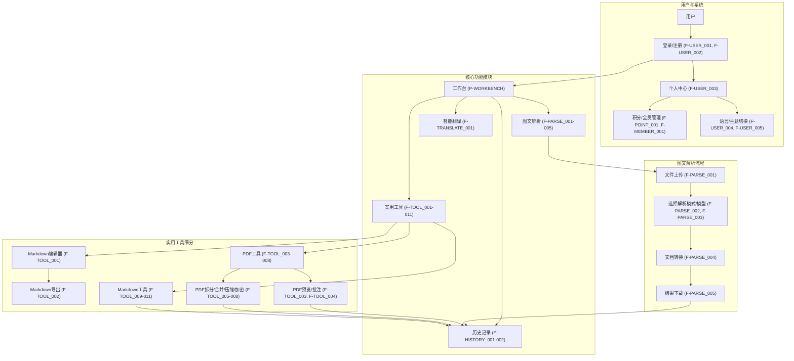
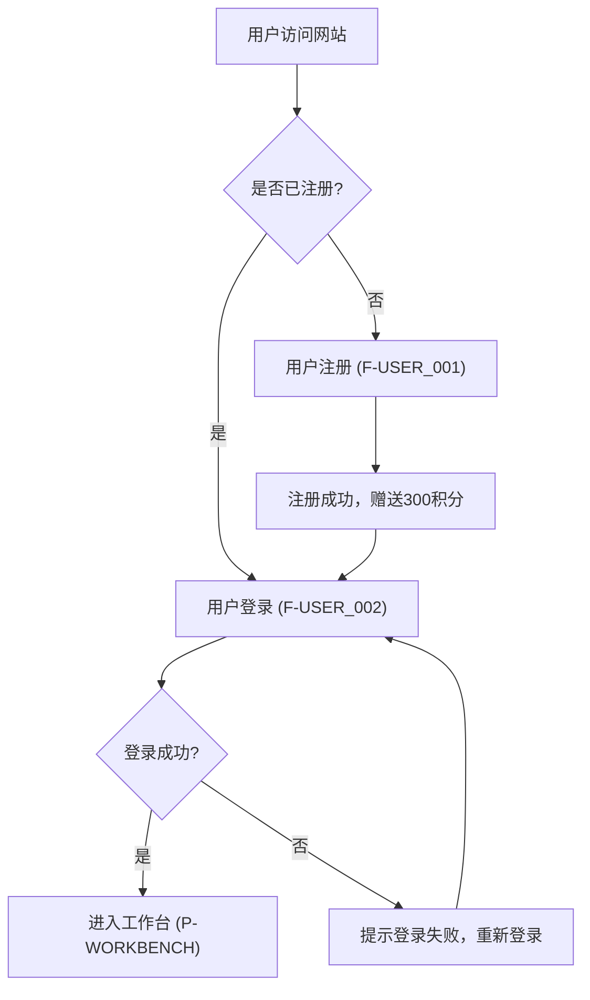
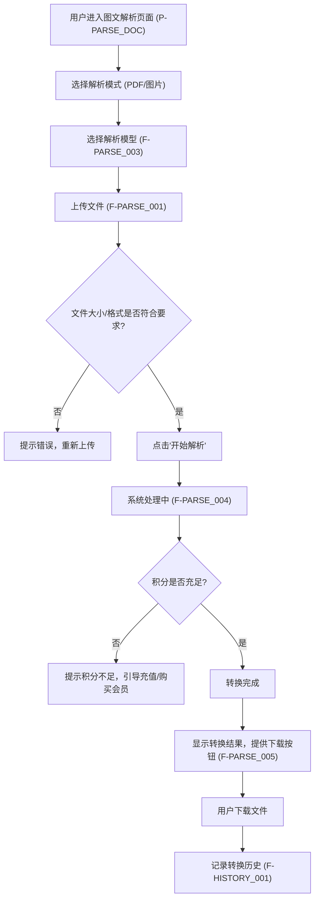
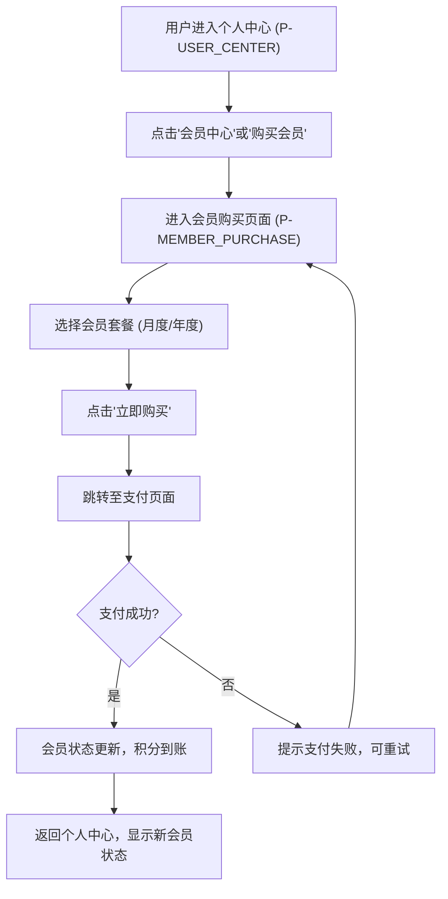
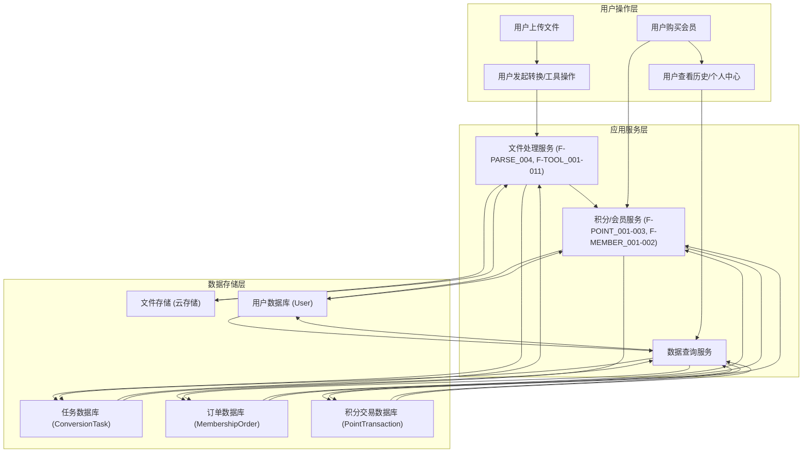

# 智转文（Doc2X）产品需求文档

## 1. 产品概述

### 1.1 产品名称与定位

*   **产品名称:** 智转文（Doc2X）
*   **产品定位:** 一款基于AI-OCR技术的Web端文档处理工具，旨在帮助用户高效地将PDF、图片等非可编辑格式文件转换为可编辑的Word文档，并提供一系列实用的文档处理工具。

### 1.2 产品应用语言

*   **产品应用语言:** 支持简体中文和英语切换，并能记住用户上次选择的语言偏好。

### 1.3 产品愿景与目标

*   **产品愿景:** 成为用户信赖的智能文档转换与处理平台，通过AI技术赋能，让文档处理变得简单、高效、准确。
*   **产品目标:**
    *   提供高准确率的PDF/图片到Word的转换服务，完全保留原始排版格式。
    *   提供便捷的Markdown编辑和PDF工具，满足用户多样化的文档处理需求。
    *   通过积分和会员体系，实现用户增长和商业变现。
    *   提供流畅、直观的Web端用户体验。

### 1.4 产品使用终端

*   **主要终端:** Web端桌面应用
*   **浏览器支持:** Chrome 90+、Firefox 88+、Safari 14+、Edge 90+
*   **分辨率支持:** 768x480及以上分辨率，最佳体验为1920x1080
*   **响应式适配:** 支持768px以上的所有桌面和平板设备。

### 1.5 核心价值主张

*   **AI驱动的精准转换:** 利用先进的AI-OCR技术，实现PDF和图片内容的精准识别与转换，确保转换后的Word文档与原始文件在排版、字体、段落、表格、图片位置等方面高度一致。
*   **一站式文档处理:** 整合图文解析、智能翻译、Markdown编辑、PDF工具等多种功能，满足用户从转换到编辑、再到优化的全链路文档处理需求。
*   **高效便捷的用户体验:** 简洁直观的界面设计，清晰的操作流程，支持批量处理和多种导出格式，显著提升用户的文档处理效率。
*   **灵活的会员与积分体系:** 提供多样化的会员套餐和积分管理，满足不同用户的使用需求，并确保服务的可持续性。

### 1.6 目标用户群体分析

*   **学生:** 需要将教材、课件、笔记等纸质或图片资料转换为电子文档进行整理、批注和复习。
*   **办公人员:** 经常需要处理合同、报告、发票等PDF文件，需要将其转换为可编辑格式进行修改、归档或分享。
*   **研究人员:** 阅读大量学术论文和研究报告，需要将其中的图表、数据、文字内容提取并整理到自己的文档中。
*   **内容创作者/编辑:** 需要将不同来源的图文内容整合、编辑，并输出为多种格式。

### 1.7 市场需求与竞品简析

*   **市场需求:** 随着数字化办公和学习的普及，用户对文档格式转换和处理的需求日益增长。传统的转换工具往往在排版还原度、识别准确率上存在不足，而AI-OCR技术的发展为解决这些痛点提供了新的可能。用户需要一款能够高效、准确、便捷地处理各类文档的工具。
*   **竞品简析:**
    *   **Adobe Acrobat Pro:** 功能强大，但价格昂贵，且部分高级功能对普通用户而言过于复杂。
    *   **WPS Office/微软Office:** 提供部分转换功能，但在AI-OCR和复杂排版还原方面可能不如专业工具。
    *   **在线转换工具:** 数量众多，但质量参差不齐，部分工具存在隐私泄露风险，且在排版还原和批量处理上有局限。
*   **智转文优势:** 专注于AI-OCR技术，强调排版还原度和识别准确率，提供一站式的文档处理解决方案，并通过Web端提供便捷的访问方式。

### 1.8 浏览器兼容性要求

*   **桌面浏览器:**
    *   Google Chrome (最新2个稳定版本)
    *   Mozilla Firefox (最新2个稳定版本)
    *   Microsoft Edge (最新2个稳定版本)
    *   Apple Safari (最新2个稳定版本)
*   **最低分辨率:** 1024x768px
*   **推荐分辨率:** 1920x1080px 及以上

## 2. 功能规格

### 2.1 功能详述

#### 2.1.1 用户与账号管理

| 功能ID | 功能名称 | 功能描述 | 优先级 |
|--------|---------|---------|--------|
| F-USER_001 | 用户注册 | 用户通过手机号/邮箱注册账号，注册成功后赠送300积分。 | P0 |
| F-USER_002 | 用户登录 | 用户通过注册的手机号/邮箱及密码登录系统。 | P0 |
| F-USER_003 | 个人中心 | 用户可查看个人信息、积分余额、会员状态、历史记录等。 | P0 |
| F-USER_004 | 语言切换 | 用户可在简体中文和英语之间切换产品界面语言，并记住上次选择。 | P0 |
| F-USER_005 | 主题切换 | 用户可选择浅色主题、深色主题或跟随系统主题。 | P1 |

#### 2.1.2 积分与会员管理

| 功能ID | 功能名称 | 功能描述 | 优先级 |
|--------|---------|---------|--------|
| F-POINT_001 | 积分获取 | 注册赠送300积分。月度会员每月获得650积分，年度会员每年获得14000积分。 | P0 |
| F-POINT_002 | 积分消耗 | 每次文档转换（每页）消耗1积分。 | P0 |
| F-POINT_003 | 积分过期 | 积分自动继承到下一会员周期。 | P1 |
| F-MEMBER_001 | 会员购买 | 用户可购买月度会员（19.9元）、年度会员（99.9元）。 | P0 |
| F-MEMBER_002 | 会员权益 | Pro会员（9.9元）、月度会员、年度会员享有不同的积分额度、AI模型精度、处理速度和功能权限。 | P0 |

#### 2.1.3 图文解析

| 功能ID | 功能名称 | 功能描述 | 优先级 |
|--------|---------|---------|--------|
| F-PARSE_001 | 文件上传 | 支持上传PDF（300MB以内）、JPEG、PNG、WEBP（5MB以内）文件。 | P0 |
| F-PARSE_002 | 解析模式选择 | 用户可选择PDF解析或图片解析模式。 | P0 |
| F-PARSE_003 | 模型选择 | 用户可选择不同的解析模型（如doc2cv-v2-2410、doc2cv-v3-2509-beta）。 | P0 |
| F-PARSE_004 | 文档转换 | 将上传的文件通过AI-OCR技术转换为可编辑的Word文档，完全保留原始排版格式（字体样式、段落间距、表格结构、图片位置、页眉页脚）。 | P0 |
| F-PARSE_005 | 结果下载 | 转换完成后，用户可下载转换后的Word文档。 | P0 |

#### 2.1.4 智能翻译

| 功能ID | 功能名称 | 功能描述 | 优先级 |
|--------|---------|---------|--------|
| F-TRANSLATE_001 | PDF翻译 | 提供PDF文件的智能翻译功能，基于大规模模型实现精准翻译。 | P1 |

#### 2.1.5 实用工具

| 功能ID | 功能名称 | 功能描述 | 优先级 |
|--------|---------|---------|--------|
| F-TOOL_001 | Markdown编辑器 | 提供在线Markdown编辑功能，支持实时预览，配备格式工具栏（含标题、列表等按钮），支持选中文本一键添加格式。 | P0 |
| F-TOOL_002 | Markdown导出 | Markdown编辑器支持导出为PDF、Word、HTML、图片格式及原格式Markdown文件。 | P0 |
| F-TOOL_003 | PDF预览 | 提供PDF文件在线预览功能。 | P0 |
| F-TOOL_004 | PDF批注 | PDF预览支持高亮文本、添加注释、添加签名、添加水印功能。 | P1 |
| F-TOOL_005 | PDF拆分 | 支持按页面或书签拆分PDF文件。 | P1 |
| F-TOOL_006 | PDF合并 | 支持多份PDF文档一键组合。 | P1 |
| F-TOOL_007 | PDF压缩 | 智能减小PDF文件体积。 | P1 |
| F-TOOL_008 | PDF加密 | 为PDF文件添加口令保护。 | P1 |
| F-TOOL_009 | Markdown拆分 | 支持按标题拆分Markdown文档。 | P2 |
| F-TOOL_010 | Markdown合并 | 支持汇总多份Markdown稿件。 | P2 |
| F-TOOL_011 | Markdown格式化 | 一键整理Markdown文档的排版结构。 | P2 |

#### 2.1.6 历史记录

| 功能ID | 功能名称 | 功能描述 | 优先级 |
|--------|---------|---------|--------|
| F-HISTORY_001 | 历史记录查看 | 用户可查看历史转换记录、结果和历史上传文件。 | P0 |
| F-HISTORY_002 | 历史记录保存 | 历史记录保存7天。 | P0 |

### 2.2 功能模块间的关系图

## 3. 用户流程

### 3.1 用户旅程地图

| 阶段 | 用户行为 | 系统响应 | 痛点/需求 | 解决方案 | 情感 |
|---|---|---|---|---|---|
| **发现与注册** | 访问网站，了解产品功能，注册账号 | 展示产品优势，引导注册，注册成功赠送积分 | 注册流程繁琐，不确定产品是否满足需求 | 简洁注册流程，明确功能介绍，注册即赠积分 | 期待 -> 满意 |
| **首次使用** | 登录，探索工作台，尝试首次转换 | 引导至核心功能，提供新手教程，展示积分余额 | 不知如何开始，担心积分消耗 | 清晰的工作台布局，新手引导，积分提示 | 好奇 -> 安心 |
| **文档转换** | 上传文件，选择解析模式/模型，开始转换 | 显示上传进度，处理中提示，转换完成通知 | 转换耗时，排版错乱，积分不足 | 高效转换，精准排版还原，积分不足提示并引导充值 | 紧张 -> 惊喜 |
| **结果处理** | 下载转换结果，使用Markdown编辑器或PDF工具进行二次编辑 | 提供多种导出格式，实时预览，工具操作反馈 | 转换结果仍需大量修改，缺乏后续处理工具 | 提供在线编辑和多种实用工具，满足多样化需求 | 便利 -> 高效 |
| **会员与积分管理** | 查看积分余额，了解会员权益，购买会员 | 清晰展示积分使用情况，会员权益对比，购买流程 | 积分不够用，不清楚会员价值 | 透明的积分消耗，明确的会员权益，便捷的购买流程 | 犹豫 -> 信任 |
| **历史回顾** | 查找历史转换记录，下载旧文件 | 展示历史列表，支持搜索筛选，提供下载入口 | 忘记转换过哪些文件，无法找回旧文件 | 完整的历史记录，方便的查找和下载 | 遗忘 -> 便捷 |

### 3.2 关键业务流程图

#### 3.2.1 用户注册与登录流程

#### 3.2.2 图文解析与转换流程

#### 3.2.3 会员购买流程

### 3.3 各场景下的用户操作步骤

#### 3.3.1 场景一：首次注册并完成一次文档转换

1.  **用户操作:** 打开浏览器，输入智转文网址。
2.  **系统响应:** 显示智转文首页（P-HOME）。
3.  **用户操作:** 点击“注册”按钮。
4.  **系统响应:** 跳转至注册页面（P-REGISTER）。
5.  **用户操作:** 填写手机号/邮箱、密码，点击“注册”。
6.  **系统响应:** 注册成功，自动登录并跳转至工作台（P-WORKBENCH），提示获得300积分。
7.  **用户操作:** 在工作台左侧导航栏点击“图文解析”。
8.  **系统响应:** 主内容区切换至图文解析页面（P-PARSE_DOC）。
9.  **用户操作:** 选择“PDF解析”模式，选择“doc2cv-v3-2509-beta”模型，点击“上传文件”按钮，选择本地一个PDF文件（小于300MB）。
10. **系统响应:** 文件上传成功，显示文件信息。
11. **用户操作:** 点击“开始解析”按钮。
12. **系统响应:** 显示处理进度条，提示“处理中...”，积分余额减少相应页数。
13. **系统响应:** 处理完成，显示“转换成功”提示，并提供“下载Word”按钮。
14. **用户操作:** 点击“下载Word”按钮。
15. **系统响应:** 浏览器开始下载转换后的Word文件。
16. **用户操作:** 在左侧导航栏点击“历史记录”。
17. **系统响应:** 主内容区切换至历史记录页面（P-HISTORY），显示本次转换记录。

#### 3.3.2 场景二：使用Markdown编辑器并导出为PDF

1.  **用户操作:** 登录智转文，进入工作台（P-WORKBENCH）。
2.  **系统响应:** 显示工作台界面。
3.  **用户操作:** 在左侧导航栏点击“实用工具”下的“Markdown编辑器”。
4.  **系统响应:** 主内容区切换至Markdown编辑器页面（P-MARKDOWN_EDITOR）。
5.  **用户操作:** 在左侧编辑区输入Markdown内容，实时预览右侧效果。
6.  **系统响应:** 右侧预览区同步更新。
7.  **用户操作:** 点击页面顶部的“导出”按钮，选择“导出为PDF”。
8.  **系统响应:** 浏览器开始下载生成的PDF文件。

#### 3.3.3 场景三：购买月度会员

1.  **用户操作:** 登录智转文，进入工作台（P-WORKBENCH）。
2.  **系统响应:** 显示工作台界面。
3.  **用户操作:** 在左侧导航栏点击“个人中心”。
4.  **系统响应:** 主内容区切换至个人中心页面（P-USER_CENTER）。
5.  **用户操作:** 点击“会员中心”或“购买会员”按钮。
6.  **系统响应:** 跳转至会员购买页面（P-MEMBER_PURCHASE）。
7.  **用户操作:** 选择“月度会员”套餐，点击“立即购买”。
8.  **系统响应:** 跳转至支付页面（模拟）。
9.  **用户操作:** 完成支付。
10. **系统响应:** 支付成功，提示“购买成功”，并自动跳转回个人中心，显示月度会员状态和积分到账。

## 4. 数据流设计

### 4.1 数据结构与关系

*   **用户 (User):**
    *   `user_id` (PK)
    *   `username`
    *   `email` / `phone_number`
    *   `password_hash`
    *   `registration_date`
    *   `last_login_date`
    *   `current_points`
    *   `current_member_type` (e.g., 'free', 'monthly', 'annual', 'pro')
    *   `member_expiry_date`
    *   `preferred_language`
    *   `preferred_theme`
*   **文件 (File):**
    *   `file_id` (PK)
    *   `user_id` (FK to User)
    *   `original_filename`
    *   `file_path` (存储路径)
    *   `file_type` (e.g., 'pdf', 'jpg', 'png', 'webp', 'docx', 'md')
    *   `file_size`
    *   `upload_date`
    *   `is_processed` (boolean)
*   **转换任务 (ConversionTask):**
    *   `task_id` (PK)
    *   `user_id` (FK to User)
    *   `input_file_id` (FK to File)
    *   `output_file_id` (FK to File, nullable)
    *   `task_type` (e.g., 'parse_pdf', 'parse_image', 'translate_pdf', 'md_export')
    *   `model_used` (e.g., 'doc2cv-v2-2410', 'doc2cv-v3-2509-beta')
    *   `status` (e.g., 'pending', 'processing', 'completed', 'failed')
    *   `start_time`
    *   `end_time`
    *   `pages_processed`
    *   `points_consumed`
*   **会员订单 (MembershipOrder):**
    *   `order_id` (PK)
    *   `user_id` (FK to User)
    *   `member_type` (e.g., 'monthly', 'annual', 'pro')
    *   `amount`
    *   `currency`
    *   `order_date`
    *   `payment_status` (e.g., 'pending', 'paid', 'failed')
    *   `transaction_id` (支付平台交易ID)
*   **积分交易 (PointTransaction):**
    *   `transaction_id` (PK)
    *   `user_id` (FK to User)
    *   `type` (e.g., 'earn', 'consume')
    *   `points` (正数为获得，负数为消耗)
    *   `reason` (e.g., 'registration', 'member_reward', 'conversion_task', 'purchase')
    *   `related_id` (e.g., task_id, order_id)
    *   `transaction_date`

### 4.2 关键数据流向图

### 4.3 数据存储与处理原则

1.  **安全性:**
    *   用户密码采用加盐哈希存储，确保不可逆。
    *   敏感数据传输采用HTTPS加密。
    *   文件存储采用云存储服务，确保数据冗余和高可用性。
    *   定期进行安全审计和漏洞扫描。
2.  **隐私性:**
    *   严格遵守数据隐私法规，未经用户授权不得访问或分享用户数据。
    *   用户上传的文件在处理完成后，根据策略进行删除或匿名化处理，仅保留必要的元数据用于历史记录。
3.  **可扩展性:**
    *   数据库设计采用分库分表策略，支持未来业务增长。
    *   文件存储采用对象存储服务，可弹性扩展存储容量。
4.  **数据一致性:**
    *   采用事务管理确保积分、会员状态、订单等关键数据的一致性。
    *   转换任务状态流转清晰，确保任务结果的准确性。
5.  **数据备份与恢复:**
    *   定期对所有生产数据进行全量和增量备份。
    *   制定详细的数据恢复计划，确保在灾难发生时能够快速恢复服务。
6.  **历史数据管理:**
    *   历史转换记录（ConversionTask）默认保存7天，到期后自动删除或归档。
    *   用户上传的原始文件和转换后的结果文件，在历史记录删除后，也应同步删除，除非用户明确选择保留（此版本不包含此功能）。

## 5. 页面规格

### 5.1 页面概览

#### 5.1.1 整体布局架构

*   **布局模式:** Web端响应式布局 - 固定顶部导航栏 + 左侧菜单 + 主内容区。
*   **空间分配策略:**
    *   **顶部导航栏:** 高度60px，固定定位，包含Logo、全局搜索、消息通知、用户头像、语言/主题切换。
    *   **左侧菜单:** 宽度200-240px（展开）/48-56px（折叠），固定定位，用于功能模块导航。
    *   **主内容区:** 动态宽度，占据剩余空间，最小宽度720px，用于展示各功能模块的具体内容。
    *   **右侧面板:** **严格限制使用**，仅在屏幕宽度≥1440px且功能确实必要时使用，宽度280-320px。必须在布局中占据独立空间，绝对不能遮挡主内容区，且需确保主内容区宽度≥720px。
*   **导航体系:** 顶部主导航（用户相关操作）+ 左侧功能菜单（核心功能模块）+ 面包屑导航（主内容区内层级导航）。
*   **交互模式:** 页面切换（通过左侧菜单）、模态弹窗（表单提交、确认操作）、侧边抽屉（详情查看）、右键菜单（快捷操作）。

#### 5.1.2 页面列表

| 页面ID | 页面名称 | 核心功能 | 布局类型 | 右侧面板 |
|--------|---------|---------|---------|---------|
| P-HOME | 首页 | 产品介绍、功能入口、用户引导 | 单栏/二栏布局 | 慎用(仅在≥1440px且必要时) |
| P-LOGIN | 登录页 | 用户登录 | 单栏居中 | 不使用 |
| P-REGISTER | 注册页 | 用户注册 | 单栏居中 | 不使用 |
| P-WORKBENCH | 工作台 | 核心功能模块入口、概览 | 二栏布局 | 慎用(仅在≥1440px且必要时) |
| P-PARSE_DOC | 图文解析页 | PDF/图片上传、解析、转换 | 二栏布局 | 不使用 |
| P-TRANSLATE_DOC | 智能翻译页 | PDF文件翻译 | 二栏布局 | 不使用 |
| P-UTILITIES | 实用工具中心页 | 各类工具功能入口 | 二栏布局 | 不使用 |
| P-MARKDOWN_EDITOR | Markdown编辑器页 | 在线Markdown编辑、预览、导出 | 二栏布局 | 不使用 |
| P-PDF_TOOLS | PDF工具页 | PDF拆分、合并、压缩、加密 | 二栏布局 | 不使用 |
| P-MARKDOWN_TOOLS | Markdown工具页 | Markdown拆分、合并、格式化 | 二栏布局 | 不使用 |
| P-HISTORY | 历史记录页 | 查看历史转换记录、结果、文件 | 二栏布局 | 不使用 |
| P-USER_CENTER | 个人中心页 | 个人信息、积分、会员状态管理 | 二栏布局 | 不使用 |
| P-MEMBER_PURCHASE | 会员购买页 | 会员套餐选择与购买 | 二栏布局 | 不使用 |

### 5.2 页面详情

#### 5.2.1 首页（P-HOME）

**布局架构设计：**
- 页面类型：展示页面，包含核心内容展示和导航功能。
- 布局模式：灵活布局，根据内容类型选择单栏或可选三栏。
- 空间分配：顶部导航 + 主内容区(最小720px) + 可选侧边区域。

**页面布局架构：**
- 顶部导航栏：Logo、主导航菜单（如“首页”、“功能介绍”、“定价”、“帮助”）、搜索框、操作按钮区（登录/注册） - 建议高度60px，固定定位。
- 左侧菜单：无（或仅在登录后显示）。
- 主内容区域：核心展示区域，建议最小宽度720px。
  - 页面头部：产品Slogan、核心价值主张、CTA按钮（如“立即体验”、“免费注册”） - 建议高度200-300px。
  - 功能介绍区：以卡片或图文形式展示主要功能（图文解析、智能翻译、实用工具），引导用户了解。
  - 客户案例/评价区：展示用户评价或成功案例。
  - 底部区域：版权信息、隐私政策、服务条款等链接。
- 右侧面板：**慎用**：仅在屏幕宽度≥1440px且功能确实必要时使用，辅助功能区域，宽度280-320px。
  - 推荐内容：相关推荐、热门内容等（非关键信息）。
  - 操作面板：快速操作、工具栏等（非核心功能）。
  - 信息展示：统计信息、状态显示等（必须在主内容区有完整替代方案）。

**响应式适配策略：**
- 大屏幕(≥1440px)：推荐单栏或二栏布局，仅在功能确实必要时考虑三栏布局，如使用三栏则左侧200-240px + 主内容区(≥720px) + 右侧280-320px（所有面板均占据布局空间，严禁遮挡）。
- 中屏幕(1200-1439px)：二栏布局，**严禁使用右侧面板**，主内容区充满剩余空间。
- 小屏幕(768-1199px)：单栏布局，左侧菜单折叠或抽屉式，内容改为响应式布局（抽屉式菜单需用户主动触发）。
- 移动端(<768px)：单栏布局，内容单列显示，保持核心功能（所有侧边面板均隐藏或抽屉化）。

**组件尺寸规范：**
- 按钮尺寸：主要操作按钮36px高度，次要按钮32px高度。
- 输入框：搜索框36px高度。
- 内容卡片：最小高度120px，宽度自适应，最小200px。
- 图标尺寸：导航图标20px，操作图标16px。
- 间距规范：卡片间距16px，区域间距20px，组件内间距12px。

**核心功能：**
产品介绍、功能展示、用户引导、注册/登录入口。

#### 5.2.2 登录页（P-LOGIN）

**布局架构设计：**
- 页面类型：表单页，用于用户身份验证。
- 布局模式：单栏居中布局。
- 空间分配：核心表单区域居中显示，背景为产品品牌元素。

**页面布局架构：**
- 顶部导航栏：Logo、产品名称 - 建议高度60px。
- 左侧菜单：无。
- 主内容区域：居中显示登录表单。
  - 登录表单：包含用户名/手机号/邮箱输入框、密码输入框、记住密码复选框、登录按钮、忘记密码链接、注册链接。
- 右侧面板：无。

**响应式适配策略：**
- 大屏幕(≥1440px)：单栏居中，表单区域最大宽度400px。
- 中屏幕(1200-1439px)：单栏居中，表单区域最大宽度400px。
- 小屏幕(768-1199px)：单栏居中，表单区域宽度自适应，最大宽度400px。
- 移动端(<768px)：单栏布局，表单区域宽度自适应，充满屏幕宽度（留白）。

**组件尺寸规范：**
- 按钮尺寸：登录按钮40px高度。
- 输入框：40px高度。
- 间距规范：表单项间距16px，按钮与表单间距24px。

**核心功能：**
用户登录认证。

#### 5.2.3 注册页（P-REGISTER）

**布局架构设计：**
- 页面类型：表单页，用于新用户注册。
- 布局模式：单栏居中布局。
- 空间分配：核心表单区域居中显示，背景为产品品牌元素。

**页面布局架构：**
- 顶部导航栏：Logo、产品名称 - 建议高度60px。
- 左侧菜单：无。
- 主内容区域：居中显示注册表单。
  - 注册表单：包含用户名/手机号/邮箱输入框、密码输入框、确认密码输入框、验证码输入框（可选）、用户协议复选框、注册按钮、已有账号登录链接。
- 右侧面板：无。

**响应式适配策略：**
- 大屏幕(≥1440px)：单栏居中，表单区域最大宽度400px。
- 中屏幕(1200-1439px)：单栏居中，表单区域最大宽度400px。
- 小屏幕(768-1199px)：单栏居中，表单区域宽度自适应，最大宽度400px。
- 移动端(<768px)：单栏布局，表单区域宽度自适应，充满屏幕宽度（留白）。

**组件尺寸规范：**
- 按钮尺寸：注册按钮40px高度。
- 输入框：40px高度。
- 间距规范：表单项间距16px，按钮与表单间距24px。

**核心功能：**
新用户注册。

#### 5.2.4 工作台（P-WORKBENCH）

**布局架构设计：**
- 页面类型：仪表盘/概览页，核心功能模块入口。
- 布局模式：二栏布局（左侧菜单 + 主内容区）。
- 空间分配：顶部导航 + 左侧菜单 + 主内容区。

**页面布局架构：**
- 顶部导航栏：Logo、全局搜索、消息通知、用户头像、语言/主题切换 - 建议高度60px，固定定位。
- 左侧菜单：功能导航菜单（如“工作台”、“图文解析”、“智能翻译”、“实用工具”、“历史记录”、“个人中心”），支持折叠 - 建议宽度200-240px(展开)/48-56px(折叠)。
- 主内容区域：核心展示区域，建议最小宽度720px。
  - 页面头部：欢迎信息、面包屑导航（如“工作台”） - 建议高度48-60px。
  - 概览卡片区：展示用户积分余额、会员状态、待处理任务数等关键信息。
  - 快捷入口区：以卡片或图标形式展示常用功能（如“开始转换”、“Markdown编辑器”、“PDF工具”）。
  - 最近活动/任务列表：显示用户最近的转换任务或操作记录。
- 右侧面板：**慎用**：仅在屏幕宽度≥1440px且功能确实必要时使用，辅助功能区域，宽度280-320px。
  - 推荐内容：相关推荐、热门内容等（非关键信息）。
  - 操作面板：快速操作、工具栏等（非核心功能）。
  - 信息展示：统计信息、状态显示等（必须在主内容区有完整替代方案）。

**响应式适配策略：**
- 大屏幕(≥1440px)：二栏布局，仅在功能确实必要时考虑三栏布局，如使用三栏，左侧200-240px + 主内容区(≥720px) + 右侧280-320px（所有面板均占据布局空间，严禁遮挡）。
- 中屏幕(1200-1439px)：二栏布局，**严禁使用右侧面板**，主内容区充满剩余空间。
- 小屏幕(768-1199px)：左侧菜单折叠或抽屉式，内容改为响应式布局（抽屉式菜单需用户主动触发）。
- 移动端(<768px)：单栏布局，内容单列显示，保持核心功能（所有侧边面板均隐藏或抽屉化）。

**组件尺寸规范：**
- 按钮尺寸：主要操作按钮36px高度，次要按钮32px高度。
- 输入框：搜索框36px高度。
- 概览卡片：最小高度120px，宽度自适应，最小200px。
- 列表行高：36px。
- 图标尺寸：导航图标20px，操作图标16px。
- 间距规范：卡片间距16px，区域间距20px，组件内间距12px。

**核心功能：**
用户概览、快捷功能入口、最近活动展示。

#### 5.2.5 图文解析页（P-PARSE_DOC）

**布局架构设计：**
- 页面类型：功能操作页，用于文件上传和转换。
- 布局模式：二栏布局（左侧菜单 + 主内容区）。
- 空间分配：顶部导航 + 左侧菜单 + 主内容区。

**页面布局架构：**
- 顶部导航栏：Logo、全局搜索、消息通知、用户头像、语言/主题切换 - 建议高度60px，固定定位。
- 左侧菜单：功能导航菜单，当前选中“图文解析”，支持折叠 - 建议宽度200-240px(展开)/48-56px(折叠)。
- 主内容区域：核心操作区域，建议最小宽度720px。
  - 页面头部：页面标题“图文解析”、面包屑导航 - 建议高度48-60px。
  - 解析模式选择区：提供“PDF解析”和“图片解析”两个Tab或按钮，用户可切换。
  - 模型选择区：下拉菜单或单选框，选择解析模型（如doc2cv-v2-2410、doc2cv-v3-2509-beta）。
  - 文件上传区：拖拽上传区域或点击上传按钮，显示支持的文件类型（PDF、JPEG、PNG、WEBP）和大小限制（PDF 300MB，图片5MB）。
  - 已上传文件列表：显示已上传文件的名称、大小、类型，支持删除。
  - 操作按钮区：包含“开始解析”按钮。
  - 转换进度/结果区：显示转换进度条、处理状态，转换完成后显示下载按钮。
- 右侧面板：无。

**响应式适配策略：**
- 大屏幕(≥1440px)：二栏布局，主内容区宽度自适应。
- 中屏幕(1200-1439px)：二栏布局，主内容区宽度自适应。
- 小屏幕(768-1199px)：左侧菜单折叠或抽屉式，内容改为单列布局。
- 移动端(<768px)：单栏布局，内容单列显示，保持核心功能。

**组件尺寸规范：**
- 按钮尺寸：开始解析按钮40px高度。
- 输入框：文件上传区域高度150-200px。
- 列表行高：40px。
- 间距规范：区域间距24px，组件间距16px。

**核心功能：**
文件上传、解析模式选择、模型选择、文档转换、结果下载。

#### 5.2.6 智能翻译页（P-TRANSLATE_DOC）

**布局架构设计：**
- 页面类型：功能操作页，用于PDF文件翻译。
- 布局模式：二栏布局（左侧菜单 + 主内容区）。
- 空间分配：顶部导航 + 左侧菜单 + 主内容区。

**页面布局架构：**
- 顶部导航栏：Logo、全局搜索、消息通知、用户头像、语言/主题切换 - 建议高度60px，固定定位。
- 左侧菜单：功能导航菜单，当前选中“智能翻译”，支持折叠 - 建议宽度200-240px(展开)/48-56px(折叠)。
- 主内容区域：核心操作区域，建议最小宽度720px。
  - 页面头部：页面标题“智能翻译”、面包屑导航 - 建议高度48-60px。
  - 文件上传区：拖拽上传区域或点击上传按钮，显示支持的文件类型（PDF）和大小限制。
  - 已上传文件列表：显示已上传文件的名称、大小、类型，支持删除。
  - 翻译设置区：源语言和目标语言选择下拉菜单。
  - 操作按钮区：包含“开始翻译”按钮。
  - 翻译进度/结果区：显示翻译进度条、处理状态，翻译完成后显示下载按钮。
- 右侧面板：无。

**响应式适配策略：**
- 大屏幕(≥1440px)：二栏布局，主内容区宽度自适应。
- 中屏幕(1200-1439px)：二栏布局，主内容区宽度自适应。
- 小屏幕(768-1199px)：左侧菜单折叠或抽屉式，内容改为单列布局。
- 移动端(<768px)：单栏布局，内容单列显示，保持核心功能。

**组件尺寸规范：**
- 按钮尺寸：开始翻译按钮40px高度。
- 输入框：文件上传区域高度150-200px。
- 列表行高：40px。
- 间距规范：区域间距24px，组件间距16px。

**核心功能：**
PDF文件上传、语言选择、智能翻译、结果下载。

#### 5.2.7 实用工具中心页（P-UTILITIES）

**布局架构设计：**
- 页面类型：功能导航页，展示各类实用工具入口。
- 布局模式：二栏布局（左侧菜单 + 主内容区）。
- 空间分配：顶部导航 + 左侧菜单 + 主内容区。

**页面布局架构：**
- 顶部导航栏：Logo、全局搜索、消息通知、用户头像、语言/主题切换 - 建议高度60px，固定定位。
- 左侧菜单：功能导航菜单，当前选中“实用工具”，支持折叠 - 建议宽度200-240px(展开)/48-56px(折叠)。
- 主内容区域：核心展示区域，建议最小宽度720px。
  - 页面头部：页面标题“实用工具”、面包屑导航 - 建议高度48-60px。
  - 工具分类区：以卡片或列表形式展示各类工具入口，如：
    - Markdown编辑器（F-TOOL_001）
    - PDF工具（F-TOOL_003-008）
    - Markdown工具（F-TOOL_009-011）
  - 每个工具入口包含工具名称、简要描述和图标。
- 右侧面板：无。

**响应式适配策略：**
- 大屏幕(≥1440px)：二栏布局，主内容区宽度自适应。
- 中屏幕(1200-1439px)：二栏布局，主内容区宽度自适应。
- 小屏幕(768-1199px)：左侧菜单折叠或抽屉式，内容改为单列布局。
- 移动端(<768px)：单栏布局，内容单列显示，保持核心功能。

**组件尺寸规范：**
- 按钮尺寸：工具卡片点击区域高度120-180px。
- 间距规范：卡片间距16px，区域间距24px。

**核心功能：**
各类实用工具的导航入口。

#### 5.2.8 Markdown编辑器页（P-MARKDOWN_EDITOR）

**布局架构设计：**
- 页面类型：功能操作页，用于在线Markdown编辑。
- 布局模式：二栏布局（左侧菜单 + 主内容区）。
- 空间分配：顶部导航 + 左侧菜单 + 主内容区。

**页面布局架构：**
- 顶部导航栏：Logo、全局搜索、消息通知、用户头像、语言/主题切换 - 建议高度60px，固定定位。
- 左侧菜单：功能导航菜单，当前选中“实用工具”下的“Markdown编辑器”，支持折叠 - 建议宽度200-240px(展开)/48-56px(折叠)。
- 主内容区域：核心操作区域，建议最小宽度720px。
  - 页面头部：页面标题“Markdown编辑器”、面包屑导航、操作按钮（如“新建”、“打开”、“保存”、“导出”）及格式工具栏（包含标题级别、粗体、斜体、列表等格式化按钮） - 建议高度48-60px。
  - 编辑/预览区：左右两栏布局，左侧为Markdown编辑区（文本输入框），右侧为实时预览区。
  - 导出选项：点击“导出”按钮后，弹出导出格式选择（PDF、Word、HTML、图片）。
- 右侧面板：无。

**响应式适配策略：**
- 大屏幕(≥1440px)：二栏布局，主内容区宽度自适应。
- 中屏幕(1200-1439px)：二栏布局，主内容区宽度自适应。
- 小屏幕(768-1199px)：左侧菜单折叠或抽屉式，编辑/预览区可切换显示（Tab切换）。
- 移动端(<768px)：单栏布局，编辑/预览区可切换显示（Tab切换）。

**组件尺寸规范：**
- 按钮尺寸：操作按钮32-36px高度。
- 编辑区/预览区：高度自适应，占据主内容区大部分空间。
- 间距规范：区域间距24px，组件间距16px。

**核心功能：**
在线Markdown编辑、实时预览、格式工具栏（标题、列表等一键格式化）、多格式导出（含原格式Markdown导出），支持从历史记录打开md文件进行在线预览和编辑。

#### 5.2.9 PDF工具页（P-PDF_TOOLS）

**布局架构设计：**
- 页面类型：功能操作页，用于PDF文件的拆分、合并、压缩、加密。
- 布局模式：二栏布局（左侧菜单 + 主内容区）。
- 空间分配：顶部导航 + 左侧菜单 + 主内容区。

**页面布局架构：**
- 顶部导航栏：Logo、全局搜索、消息通知、用户头像、语言/主题切换 - 建议高度60px，固定定位。
- 左侧菜单：功能导航菜单，当前选中“实用工具”下的“PDF工具”，支持折叠 - 建议宽度200-240px(展开)/48-56px(折叠)。
- 主内容区域：核心操作区域，建议最小宽度720px。
  - 页面头部：页面标题“PDF工具”、面包屑导航 - 建议高度48-60px。
  - 工具Tab区：提供“拆分”、“合并”、“压缩”、“加密”四个Tab，用户可切换。
  - **拆分Tab:**
    - 文件上传区：拖拽上传区域或点击上传按钮，支持单个PDF文件。
    - 拆分方式选择：按页面范围（输入页码）、按书签。
    - 操作按钮：“开始拆分”。
    - 结果区：显示拆分结果，提供下载按钮。
  - **合并Tab:**
    - 文件上传区：拖拽上传区域或点击上传按钮，支持多个PDF文件。
    - 文件排序：可拖拽调整文件顺序。
    - 操作按钮：“开始合并”。
    - 结果区：显示合并结果，提供下载按钮。
  - **压缩Tab:**
    - 文件上传区：拖拽上传区域或点击上传按钮，支持单个PDF文件。
    - 压缩级别选择：下拉菜单（如“高压缩”、“平衡”、“低压缩”）。
    - 操作按钮：“开始压缩”。
    - 结果区：显示压缩结果，提供下载按钮。
  - **加密Tab:**
    - 文件上传区：拖拽上传区域或点击上传按钮，支持单个PDF文件。
    - 密码输入框：设置打开密码、权限密码。
    - 操作按钮：“开始加密”。
    - 结果区：显示加密结果，提供下载按钮。
- 右侧面板：无。

**响应式适配策略：**
- 大屏幕(≥1440px)：二栏布局，主内容区宽度自适应。
- 中屏幕(1200-1439px)：二栏布局，主内容区宽度自适应。
- 小屏幕(768-1199px)：左侧菜单折叠或抽屉式，内容改为单列布局。
- 移动端(<768px)：单栏布局，内容单列显示，保持核心功能。

**组件尺寸规范：**
- 按钮尺寸：操作按钮36-40px高度。
- 输入框：文件上传区域高度150-200px。
- 间距规范：区域间距24px，组件间距16px。

**核心功能：**
PDF文件拆分、合并、压缩、加密。

#### 5.2.10 Markdown工具页（P-MARKDOWN_TOOLS）

**布局架构设计：**
- 页面类型：功能操作页，用于Markdown文件的拆分、合并、格式化。
- 布局模式：二栏布局（左侧菜单 + 主内容区）。
- 空间分配：顶部导航 + 左侧菜单 + 主内容区。

**页面布局架构：**
- 顶部导航栏：Logo、全局搜索、消息通知、用户头像、语言/主题切换 - 建议高度60px，固定定位。
- 左侧菜单：功能导航菜单，当前选中“实用工具”下的“Markdown工具”，支持折叠 - 建议宽度200-240px(展开)/48-56px(折叠)。
- 主内容区域：核心操作区域，建议最小宽度720px。
  - 页面头部：页面标题“Markdown工具”、面包屑导航 - 建议高度48-60px。
  - 工具Tab区：提供“拆分”、“合并”、“格式化”三个Tab，用户可切换。
  - **拆分Tab:**
    - 文件上传区：拖拽上传区域或点击上传按钮，支持单个Markdown文件。
    - 拆分方式选择：按标题级别（下拉菜单选择）。
    - 操作按钮：“开始拆分”。
    - 结果区：显示拆分结果，提供下载按钮。
  - **合并Tab:**
    - 文件上传区：拖拽上传区域或点击上传按钮，支持多个Markdown文件。
    - 文件排序：可拖拽调整文件顺序。
    - 操作按钮：“开始合并”。
    - 结果区：显示合并结果，提供下载按钮。
  - **格式化Tab:**
    - 文件上传区：拖拽上传区域或点击上传按钮，支持单个Markdown文件。
    - 格式化选项：可选择是否保留原有格式、是否自动生成目录等。
    - 操作按钮：“开始格式化”。
    - 结果区：显示格式化结果，提供下载按钮。
- 右侧面板：无。

**响应式适配策略：**
- 大屏幕(≥1440px)：二栏布局，主内容区宽度自适应。
- 中屏幕(1200-1439px)：二栏布局，主内容区宽度自适应。
- 小屏幕(768-1199px)：左侧菜单折叠或抽屉式，内容改为单列布局。
- 移动端(<768px)：单栏布局，内容单列显示，保持核心功能。

**组件尺寸规范：**
- 按钮尺寸：操作按钮36-40px高度。
- 输入框：文件上传区域高度150-200px。
- 间距规范：区域间距24px，组件间距16px。

**核心功能：**
Markdown文件拆分、合并、格式化。

#### 5.2.11 历史记录页（P-HISTORY）

**布局架构设计：**
- 页面类型：列表页，用于展示用户的历史转换记录。
- 布局模式：二栏布局（左侧菜单 + 主内容区）。
- 空间分配：顶部导航 + 左侧菜单 + 主内容区。

**页面布局架构：**
- 顶部导航栏：Logo、全局搜索、消息通知、用户头像、语言/主题切换 - 建议高度60px，固定定位。
- 左侧菜单：功能导航菜单，当前选中“历史记录”，支持折叠 - 建议宽度200-240px(展开)/48-56px(折叠)。
- 主内容区域：核心展示区域，建议最小宽度720px。
  - 页面头部：页面标题“历史记录”、面包屑导航 - 建议高度48-60px。
  - 工具栏区域：搜索框（按文件名/任务类型搜索）、筛选条件（按时间范围、任务状态）、批量操作按钮（如“批量删除”） - 建议高度40-48px。
  - 数据展示区域：表格形式展示历史转换记录。
    - 表格列：任务ID、原始文件名、任务类型、处理状态、转换页数、消耗积分、开始时间、结束时间、操作（下载、查看详情、删除）。
  - 分页区域：分页控件，显示总数、每页条数选择、跳转功能 - 建议高度40px。
- 右侧面板：无。

**响应式适配策略：**
- 大屏幕(≥1440px)：二栏布局，主内容区宽度自适应。
- 中屏幕(1200-1439px)：二栏布局，主内容区宽度自适应。
- 小屏幕(768-1199px)：左侧菜单折叠或抽屉式，表格列可隐藏或滚动。
- 移动端(<768px)：单栏布局，表格转换为卡片列表或仅显示关键信息。

**组件尺寸规范：**
- 按钮尺寸：操作按钮32px高度。
- 输入框：搜索框36px高度。
- 表格行高：36-40px。
- 间距规范：区域间距24px，组件间距16px。

**核心功能：**
查看历史转换记录、搜索筛选、下载历史文件（文件保存期限为7天）、删除记录。

**数据结构：**
| 列名 | 数据类型 | 宽度建议 | 是否可排序 | 操作功能 |
|------|---------|----------|----------|---------|
| 任务ID | 文本 | 80px | 是 | - |
| 原始文件名 | 文本 | 200px | 是 | - |
| 文件有效期 | 文本 | 100px | 是 | 显示剩余有效天数 |
| 任务类型 | 文本 | 100px | 是 | - |
| 处理状态 | 文本 | 80px | 是 | - |
| 转换页数 | 数字 | 80px | 是 | - |
| 消耗积分 | 数字 | 80px | 是 | - |
| 开始时间 | 日期时间 | 150px | 是 | - |
| 结束时间 | 日期时间 | 150px | 是 | - |
| 操作 | 操作按钮组 | 120px | 否 | 下载、查看详情、删除 |

#### 5.2.12 个人中心页（P-USER_CENTER）

**布局架构设计：**
- 页面类型：信息展示与管理页，用于用户个人信息、积分、会员状态管理。
- 布局模式：二栏布局（左侧菜单 + 主内容区）。
- 空间分配：顶部导航 + 左侧菜单 + 主内容区。

**页面布局架构：**
- 顶部导航栏：Logo、全局搜索、消息通知、用户头像、语言/主题切换 - 建议高度60px，固定定位。
- 左侧菜单：功能导航菜单，当前选中“个人中心”，支持折叠 - 建议宽度200-240px(展开)/48-56px(折叠)。
- 主内容区域：核心展示区域，建议最小宽度720px。
  - 页面头部：页面标题“个人中心”、面包屑导航 - 建议高度48-60px。
  - 个人信息区：展示用户名、邮箱/手机号、注册日期、上次登录时间等，提供修改密码入口。
  - 积分余额区：显示当前积分余额、积分获取记录、积分消耗记录。
  - 会员状态区：显示当前会员类型、到期日期，提供购买/续费会员入口。
  - 账户安全区：提供绑定手机/邮箱、两步验证等设置。
- 右侧面板：无。

**响应式适配策略：**
- 大屏幕(≥1440px)：二栏布局，主内容区宽度自适应。
- 中屏幕(1200-1439px)：二栏布局，主内容区宽度自适应。
- 小屏幕(768-1199px)：左侧菜单折叠或抽屉式，内容改为单列布局。
- 移动端(<768px)：单栏布局，内容单列显示，保持核心功能。

**组件尺寸规范：**
- 按钮尺寸：操作按钮32-36px高度。
- 间距规范：区域间距24px，组件间距16px。

**核心功能：**
查看个人信息、管理积分、管理会员状态、账户安全设置。

#### 5.2.13 会员购买页（P-MEMBER_PURCHASE）

**布局架构设计：**
- 页面类型：功能操作页，用于会员套餐选择与购买。
- 布局模式：二栏布局（左侧菜单 + 主内容区）。
- 空间分配：顶部导航 + 左侧菜单 + 主内容区。

**页面布局架构：**
- 顶部导航栏：Logo、全局搜索、消息通知、用户头像、语言/主题切换 - 建议高度60px，固定定位。
- 左侧菜单：功能导航菜单，当前选中“个人中心”下的“会员中心”，支持折叠 - 建议宽度200-240px(展开)/48-56px(折叠)。
- 主内容区域：核心操作区域，建议最小宽度720px。
  - 页面头部：页面标题“会员购买”、面包屑导航 - 建议高度48-60px。
  - 会员套餐区：以卡片形式展示不同的会员套餐（月度会员、年度会员、Pro会员），包含套餐名称、价格、积分额度、AI模型权益、其他功能权益等。
  - 每个套餐卡片包含“立即购买”按钮。
  - 会员权益对比表：清晰展示不同会员等级的详细权益差异。
- 右侧面板：无。

**响应式适配策略：**
- 大屏幕(≥1440px)：二栏布局，主内容区宽度自适应。
- 中屏幕(1200-1439px)：二栏布局，主内容区宽度自适应。
- 小屏幕(768-1199px)：左侧菜单折叠或抽屉式，套餐卡片改为单列布局。
- 移动端(<768px)：单栏布局，套餐卡片单列显示。

**组件尺寸规范：**
- 按钮尺寸：立即购买按钮40px高度。
- 套餐卡片：高度自适应，宽度根据列数调整。
- 间距规范：卡片间距16px，区域间距24px。

**核心功能：**
会员套餐选择、购买。

